# SpaceExplorer

SpaceExplorer is a comprehensive web platform designed for space enthusiasts to explore celestial data and purchase space-themed merchandise. It includes a user-facing portal and a robust administrative dashboard for managing content, products, orders, and universe data.

## 🚀 Features

### Public Portal
* **Home:** Landing page with easy navigation to explore the universe or shop.
* **Explore Universe:** * Search and filter celestial objects (planets, moons, galaxies, etc.) by name and distance.
    * View detailed information about space objects.
* **Shop:** * Browse space-themed products like T-shirts, jackets, and accessories.
    * Filter products by price.
    * Shopping cart functionality with quantity management and checkout.

### Administrative Dashboard
* **Dashboard:** High-level overview of system statistics (total objects, total roles).
* **Product Management:** CRUD operations for space-themed products.
* **Category Management:** Organize products into different categories.
* **Universe Data Management:** Manage, create, and update celestial data (planets, moons, etc.) and their attributes (mass, radius, visibility, etc.).
* **Order Management:** Track and update the status of user orders (Paid, Cancelled, etc.).
* **User Management:** Manage registered users of the platform.

## 🛠️ Technology Stack
*(You can update this section based on the specific technologies you used, e.g., Angular, React, Node.js, Spring Boot, etc.)*
* **Frontend:** Angular
* **Backend:** [Insert Backend Tech, e.g., Spring Boot, Node.js, Python]
* **Database:** [Insert Database, e.g., MySQL, PostgreSQL, MongoDB]

## 📸 Project Preview

### Home Page

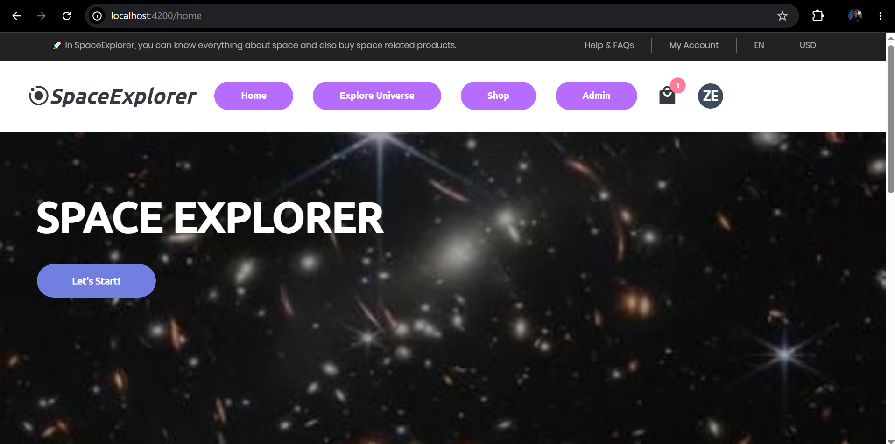

### Explore Universe Page

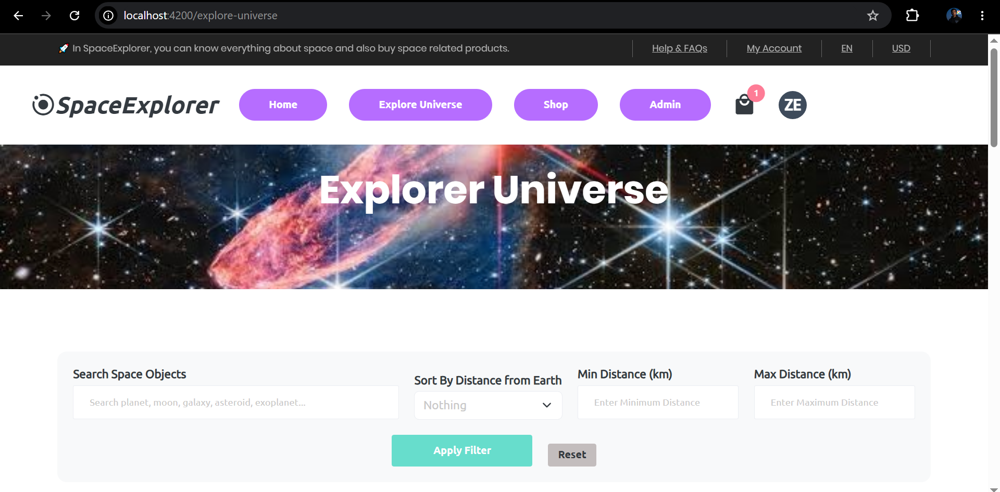

### Overview Explore Universe Page

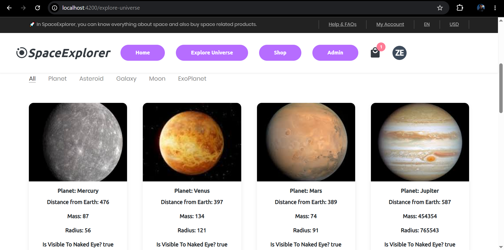

### Shop Page

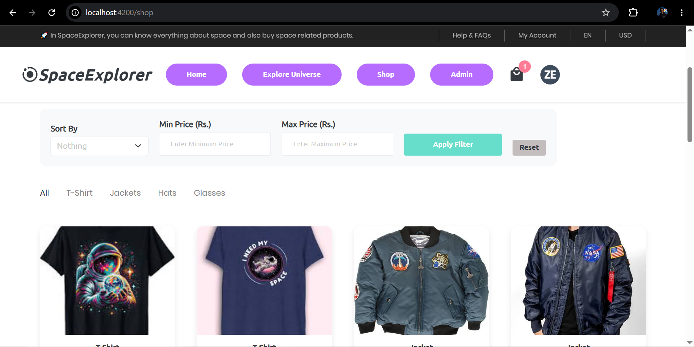

### Cart Page

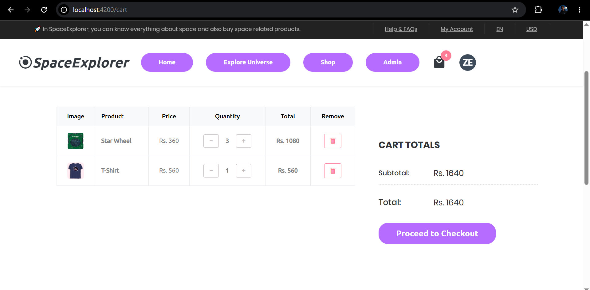

### Carts-SideView Page

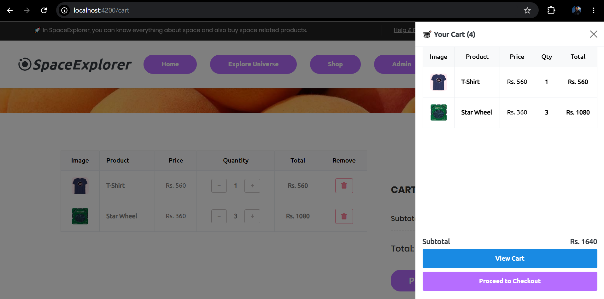

### Dashboard Page

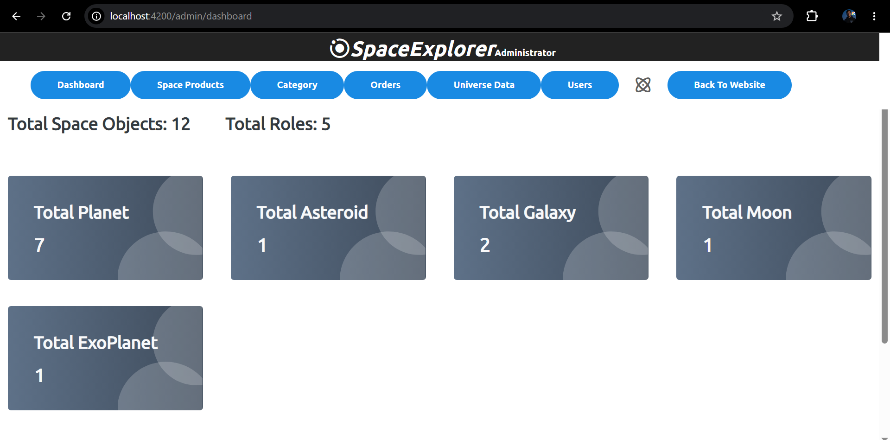

### Admin Side Products Page

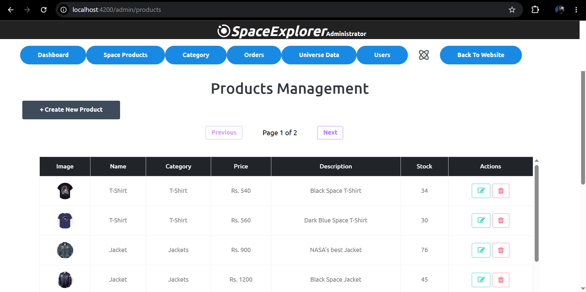

### Category Page

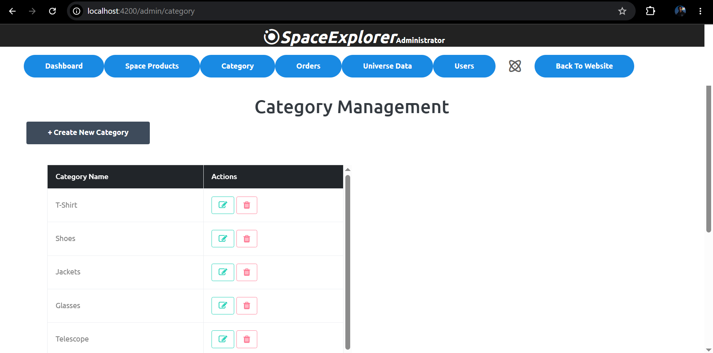

### Order Management Page

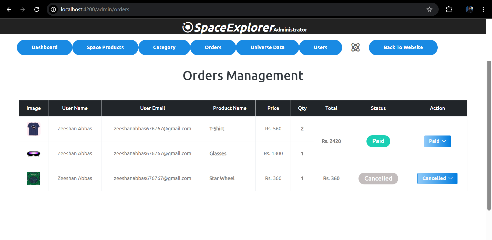

### Universe Data Page

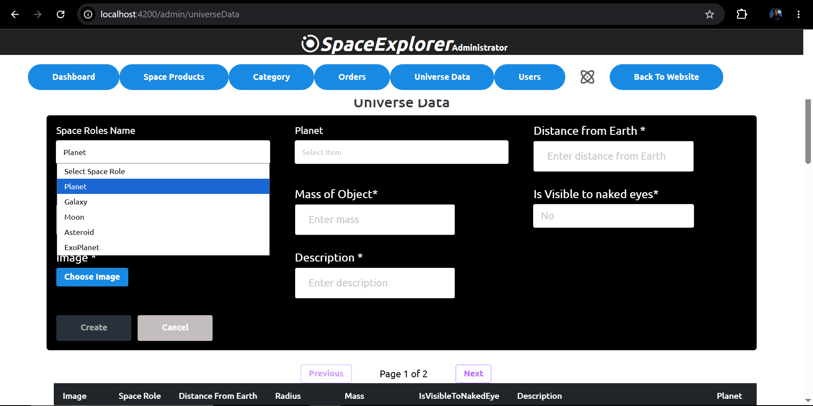

### Universe Data - SpaceRole's Items Name Dropdown 

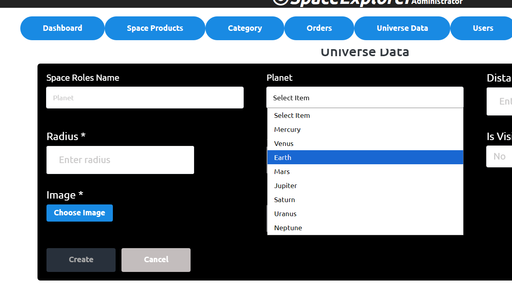

### Universe Data - Table View Page

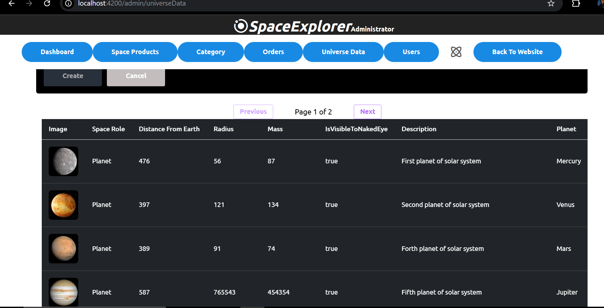

### Space Roles Page

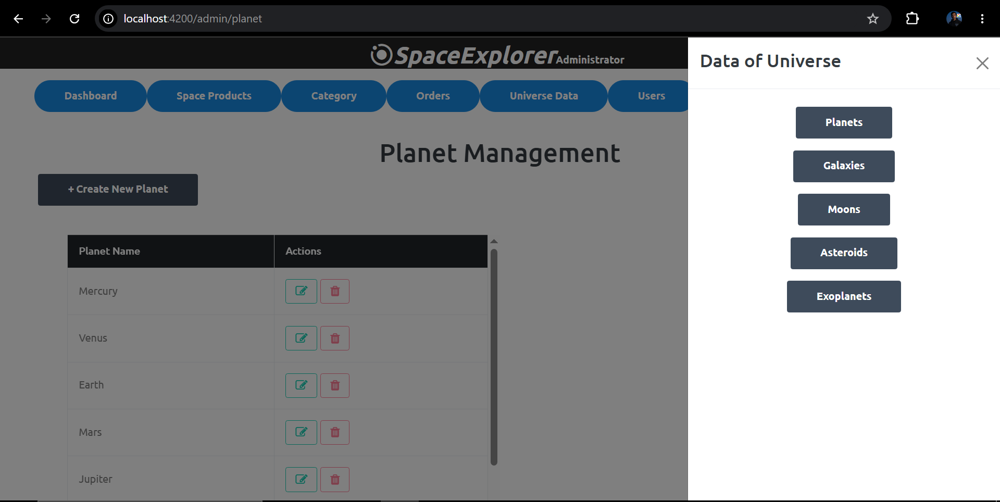
---

### Public Interface
* **Home:** Landing page for users.
* **Explore Universe:** Interface to search and view celestial data.
* **Shop:** Product catalog with filtering capabilities.
* **Shopping Cart:** Manage your items before checkout.

### Administrator Interface
* **Dashboard:** Administrative analytics overview.
* **Universe Data:** Manage celestial entities.
* **Product/Category Management:** Manage merchandise and organization.
* **Order Management:** Track customer purchases and statuses.

---
*Built with passion for space exploration.*
